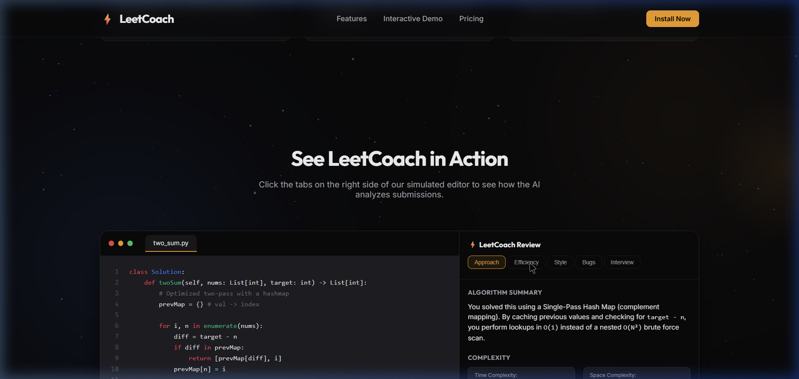
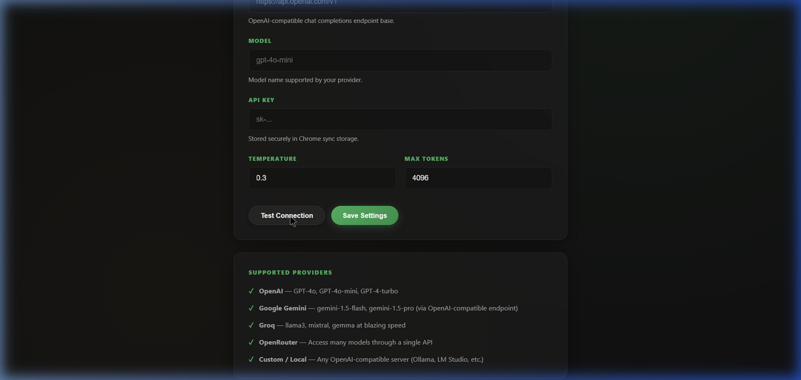

# LeetCoach AI Reviewer 🚀

**LeetCoach** is a premium, high-performance browser extension that helps software engineers master LeetCode. It integrates directly into the LeetCode sidebar to deliver real-time, context-aware AI code reviews — complexity analysis, edge-case checks, and hints — powered by the AI provider of your choice.

<p align="center">
  
  
  
</p>

---

## ✨ Features

| Feature | Description |
|---|---|
| 🔍 **Side-by-Side Code Review** | Seamlessly nested inside the LeetCode workspace — no context switching. |
| 🔑 **Bring Your Own Key** | Use OpenAI (GPT-4o), Google Gemini, Groq, OpenRouter, or a local server (Ollama, LM Studio). |
| ⏱️ **Complexity Analysis** | Instant Big-O time and space complexity breakdowns for your solution. |
| 🕳️ **Edge Case Detector** | Surfaces hidden corner cases that could silently fail your submission. |
| 🔒 **Privacy First** | API keys are encrypted in `chrome.storage.sync` and never touch a third-party server. |

---

## 🎥 Showcase

| Landing Page | Settings & Connection Test |
|---|---|
|  |  |

**Setup walkthrough:** 

---

## 🛠️ Project Structure

```text
├── downloads/
│   ├── landing/                       # Animated marketing landing page
│   │   ├── index.html                 # Markup
│   │   ├── style.css                  # Design tokens & animations
│   │   └── script.js                  # Three.js particles + simulator logic
│   │
│   └── leetcode-ai-reviewer/          # Extension source
│       ├── src/                       # Background, content, sidebar & settings scripts
│       ├── dist/                      # Bundled production build
│       ├── vite.config.ts             # Bundler configuration
│       └── EDGE_PUBLISHING_GUIDE.md   # Microsoft Edge Add-ons publishing guide
│
├── .gitignore
└── PRIVACY.md                         # Store-compliant privacy policy
```

---

## 🚀 Getting Started

### Prerequisites
- Node.js 18+ and npm
- Python 3 (only needed to preview the landing page locally)
- An API key from at least one supported provider (OpenAI, Gemini, Groq, OpenRouter, or a local LLM endpoint)

### 1. Preview the Landing Page

The landing page uses Three.js cursor-gravity animations and a GSAP-driven LeetCode simulator. Serve it locally from the repo root:

```powershell
python -m http.server 8080
```

Then open `http://localhost:8080/downloads/landing/index.html`.

### 2. Build the Extension

```powershell
cd downloads/leetcode-ai-reviewer
npm install
npm run build
npm run zip
```

This compiles the TypeScript source and outputs a store-ready package at:
`downloads/leetcode-ai-reviewer/leetcoach-extension.zip`

### 3. Load It Unpacked (for local testing)

1. Go to `chrome://extensions` (or `edge://extensions`).
2. Enable **Developer mode**.
3. Click **Load unpacked** and select `downloads/leetcode-ai-reviewer/dist`.
4. Open any LeetCode problem — the LeetCoach sidebar should appear automatically.

---

## 🌿 Git Branch Layout

To keep local tools, cookies, and cached state out of the public repo, this project uses a two-branch structure:

- **`main`** (public) — clean history; local-only files (`downloader.py`, `cookies.txt`, state backups) are excluded via `.gitignore`.
- **`local-with-downloader`** (private) — tracks everything, for personal backup and local automation.

```powershell
# Switch to the public branch
git checkout main

# Switch to the local backup branch
git checkout local-with-downloader
```

> ⚠️ Never merge `local-with-downloader` into `main` — doing so would push local secrets and cached files to GitHub.

---

## 🛡️ Privacy

LeetCoach is designed with privacy as a first principle: your API keys are encrypted at rest and never leave your browser except to call the AI provider you configured. See [PRIVACY.md](./PRIVACY.md) for the full Microsoft Edge Add-ons–compliant policy.

---

## 🤝 Contributing

Issues and pull requests are welcome. Please open an issue first for major changes so we can discuss the approach before you invest time in a PR.

## 📄 License

[MIT](./LICENSE)
